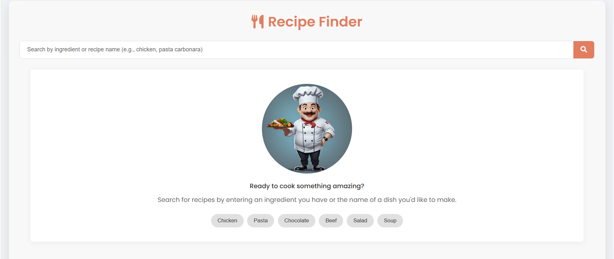
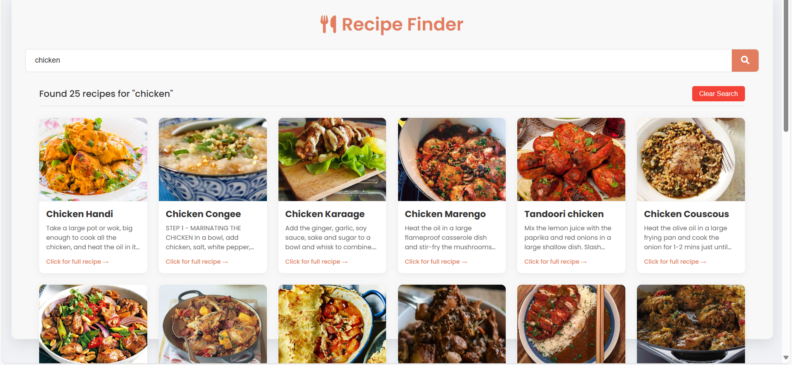
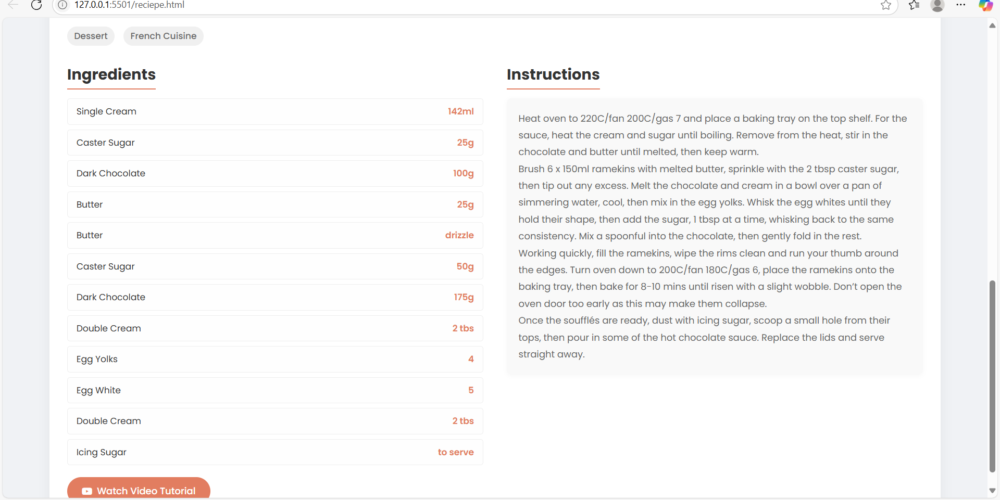

# 🍽️ Recipe Finder App

A responsive and user-friendly Recipe Finder App that allows users to search for meals by ingredient or dish name. It uses **TheMealDB API** to fetch real-time recipe data and display ingredients, cooking instructions, and images. Perfect for practicing API integration, DOM manipulation, and front-end development.

---

## ✨ Features

- 🔎 Search recipes by ingredient or dish name
- 🖼️ View results with thumbnails and brief info
- 📖 Click on a recipe to see full details (ingredients & instructions)
- ❌ Clear search input and results easily
- 📱 Responsive layout for mobile and desktop

---

## 🧰 Technologies Used

- **HTML5**
- **CSS3**
- **JavaScript**
- **Fetch API**
- **TheMealDB API** – [https://www.themealdb.com/api.php](https://www.themealdb.com/api.php)

---

 ## 📸 Screenshots

### 🔍 Search Interface

### 📋 Recipe Results

### 🍲 Recipe Details

 

---

## 🚀 Live Demo

🔗 **View Live App:**(https://tharuniporeddy.github.io/Recipe-Finder/)

